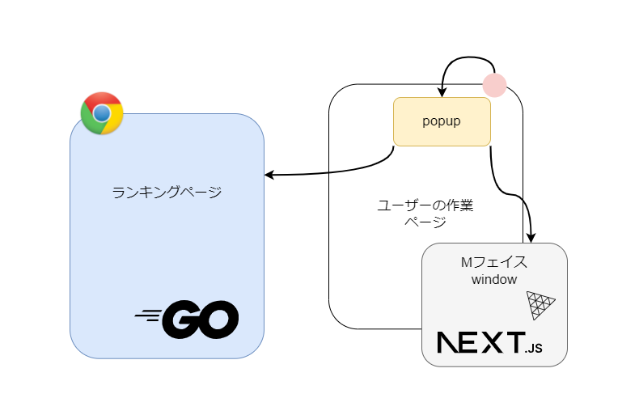

# SADISxTECH

[](https://www.canva.com/design/DAFyjDwYudg/uFacFqQrZyGtH29hhGCiKA/view?utm_content=DAFyjDwYudg&utm_campaign=designshare&utm_medium=link&utm_source=editor)

[](https://www.canva.com/design/DAFyjDwYudg/uFacFqQrZyGtH29hhGCiKA/view?utm_content=DAFyjDwYudg&utm_campaign=designshare&utm_medium=link&utm_source=editor)

## 使い方（現状、ローカルでのみ動作）

ローカルにクローン `git clone https://github.com/jphacks/TK_2316.git`

#### 拡張機能
1. Chromeの[拡張機能管理](chrome://extensions/) を開く
2. デベロッパーツールをオン
3. 「パッケージ化されていない拡張機能を取り込む」で、クローンしたフォルダ内の`TK_2316/ext/click-counter`を選択
[how to install](doc/拡張機能の取り込み方.jpg)

#### Faceウインドウ
1. `cd TK_2316/face/.devcontainer`
2. `docker compose up -d`
※初回起動時は立ち上げ後も、裏でインストール作業を行っているのでしばらく放置（docker logsなどで確認してください）

以下、コンテナ内で

3. `cd /app`
4. `yarn dev`
5. http://localhost:8090 で確認

#### ランキングページ
1. `cd TK_2316/web/.devcontainer`
2. `docker compose up -d`
ここから先は未完成


## 製品概要

表向きは、昨今の社会風潮へのアンチテーゼなサディストのためのネタツールです。

ブラウザ行動を監視して、静かに暴力性を吐き出してもらえるようtechで解決します。

[プレゼン資料](https://www.canva.com/design/DAFyjDwYudg/uFacFqQrZyGtH29hhGCiKA/view?utm_content=DAFyjDwYudg&utm_campaign=designshare&utm_medium=link&utm_source=editor)

### 背景(製品開発のきっかけ、課題等）

気楽に暴力もふるえない世知辛い世の中になりました。

サディスティックな人々（や、ノーマルな人がイライラしたとき）は、人への暴力や、キーボードを強く叩くといった表出行動でその衝動を発散するしかありません。

同時に、デスクワークの増加で、不健康と言われる長時間座り続けてしまう人が増えています。

特に、エンジニアはついついPC前にへばりついてしまいがちです。

[参考統計資料：デスクワーカー数](https://www.stat.go.jp/data/kokusei/2005/sokuhou/03.htm)

### 製品説明（具体的な製品の説明）

「SADISTECH」を起動すると、画面のクリックイベントのたびに公式キャラ「M」を鞭でたしなめることができます。

- chromeを起動し拡張機能にアクセス。

- startボタンをおし計測開始（クリック数と、開始時刻をバックグラウンド取得）

- キー入力を検知するとMを鞭でたしなめることができる

- ストップボタンで計測終了

- リンクからサディストランキング（キー入力回数）を確認できる

- 60分毎など、ユーザーが任意にアラート設定を行える（ウェルネス）


### 特長
#### 1. chromeの拡張機能なので気軽に使える。
#### 2. キーボード強打に替わる暴力体験。
#### 3. 行動管理（長時間労働抑制やリモートワークにおける出退管理など）

### 解決出来ること
一見、サディスティックな人の暴力衝動を外に向けさせることなく解消するネタアプリに見えますが、

ユーザーのブラウザ行動をログるため、使いすぎ警告をはじめとして、

ウェルネスやウェルビーイングとしての本来機能による大きな拡張性をもっています。

また、3Dキャラクタをインターフェイスとしているため、マゾヒスティックなどの別属性への展開や、LLMなどの先端技術に適応しやすいポテンシャルがあります。

### 今後の展望
まずはプレゼン資料に沿った機能の完成

- 時間経過計測
- アラート
- 鞭アニメーション
- Mのウインドウ前面固定
- Mの表情コントロール
- サディストランキング
- ランキングの共有機能


次にリファクタリング
- DBを提供サービス（HEXABASE）に切替
- 設定情報の隠匿など最低限のセキュリティ確保

さらに拡張
- 出退勤管理
- マゾヒスティックMODE、サティスフィックMODE

### 注力したこと（こだわり等）
- 各々の個人目標に沿った技術を使うこと（gin、Three.js、chrome拡張）
- 楽しむこと

## 開発技術
### 活用した技術
- ginフレームワーク
- Chrome拡張
- Three.js
- Next.js
- Docker、Docker-Compose

#### API・データ
- PlanetScale


#### ディレクトリ構成
```
- doc		要件整理や、進捗確認などあらゆるドキュメント

- example	chrome拡張機能に関するプログラム練習場所

- ext		拡張機能の本番環境

- web		ランキングのwebページ（ginのdocker環境）
    ├─.devcontainer
    ├─controllers
    ├─models
    ├─routes
    ├─static
    └─views

- face		拡張機能で表示するMウインドウのWEbページ（next・threeのdocker環境）

```

#### デバイス
- PC

### 独自技術
- 特になし

#### ハッカソンで開発した独自機能・技術
- 全体を通して楽しむことに注力しました

